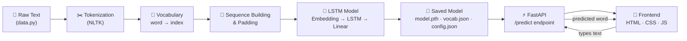

<div align="center">

# 🔮 LSTM Next Word Predictor

### A from-scratch PyTorch LSTM that predicts the next word — served live through FastAPI with an interactive web UI.

[](https://www.python.org/)
[](https://pytorch.org/)
[](https://fastapi.tiangolo.com/)
[](https://www.nltk.org/)

[](LICENSE)
[](../../stargazers)
[](../../issues)

**Type a few words → the trained LSTM predicts what comes next, live, word by word.**

[Features](#-features) • [Tech Stack](#-tech-stack) • [How It Works](#-how-it-works) • [Setup](#-installation--setup) • [API](#-api-reference) • [Structure](#-project-structure)

</div>

---

## 📖 Overview

**LSTM Next Word Predictor** is an end-to-end deep learning project that takes you from raw text all the way to a live, interactive web app:

- A **PyTorch LSTM** is trained from scratch on a custom text corpus to learn word-sequence patterns.
- A **FastAPI** backend loads the trained model and serves real-time predictions through a REST API.
- A lightweight **HTML/CSS/JavaScript** frontend lets you type text and watch the model predict — one word at a time, with a "thinking" animation, just like a real language model generating text.

No pre-trained embeddings, no external LLM APIs — the whole pipeline (tokenizing → vocabulary → training → inference) is built and trained by you, from the ground up.

---

## ✨ Features

| | |
|---|---|
| 🧠 | **Custom LSTM architecture** — Embedding → LSTM → Linear, trained from scratch |
| 📓 | **Fully documented notebook** — every step explained, from tokenization to saving the model |
| ⚡ | **FastAPI inference server** — real predictions via a clean REST API |
| 🎨 | **Interactive frontend** — word-by-word generation with a live "thinking..." animation |
| 🔁 | **Retrainable** — swap in your own text corpus and retrain in minutes |
| 📦 | **Self-contained** — model weights, vocabulary, and config are saved and versioned together |

---

## 🛠 Tech Stack

<div align="center">

| Layer | Technology |
|:---:|:---|
| 🧠 **Model** |  LSTM (Embedding → LSTM → Linear) |
| ✂️ **Preprocessing** |  Word tokenization & vocabulary building |
| 🌐 **Backend / API** |   REST endpoints for inference |
| 🎨 **Frontend** |    Vanilla, no frameworks |
| 📊 **Experimentation** |  Step-by-step training notebook |
| 🐍 **Language** |  Python 3.10+ |

</div>

---

## 🏗 Architecture



---

## 🧩 How It Works

The training pipeline (see [`notebook/`](./notebook) and [`backend/train.py`](./backend/train.py)) follows these steps:

1. **Tokenize** the training text using NLTK.
2. **Build a vocabulary** — every unique word gets a numeric index.
3. **Generate training sequences** — each sentence is broken into growing sub-sequences, e.g. `[the, course] → fee`.
4. **Pad** all sequences to a fixed length.
5. **Wrap in a PyTorch `Dataset` / `DataLoader`.**
6. **Define the LSTM model** — `Embedding → LSTM → Linear`.
7. **Train** for 50 epochs using Cross-Entropy Loss + Adam optimizer.
8. **Evaluate accuracy** on the training data.
9. **Save** `model.pth`, `vocab.json`, and `config.json` for inference.

At inference time, `backend/app.py` loads these three files, and for every request:
tokenizes the input → converts to indices → pads to the expected length → runs it through the model → returns the highest-probability next word. The frontend calls this in a loop to generate multiple words, one at a time.

---

## 📂 Project Structure

```
LSTM-Next-Word-Predictor/
│
├── 📓 notebook/
│   └── lstm_next_word_predictor.ipynb   # Full, documented training walkthrough
│
├── 🧠 backend/
│   ├── data.py         # Training text (swap this out to retrain on new text)
│   ├── model.py         # LSTM model definition
│   ├── train.py         # Preprocess → train → evaluate → save
│   └── app.py            # FastAPI server (serves /predict + the frontend)
│
├── 🎨 frontend/
│   ├── index.html       # UI
│   ├── style.css         # Styling + "thinking" animation
│   └── script.js          # Calls the FastAPI API, word-by-word generation
│
├── 💾 saved_model/
│   ├── model.pth         # Trained weights
│   ├── vocab.json         # word → index mapping
│   └── config.json        # vocab size, sequence length, accuracy
│
├── requirements.txt
└── README.md
```

---

## 🚀 Installation & Setup

### 1️⃣ Clone the repository

```bash
git clone https://github.com/zakir-maswani/LSTM-Next-Word-Predictor.git
cd LSTM-Next-Word-Predictor
```

### 2️⃣ Install dependencies

```bash
pip install -r requirements.txt
```

### 3️⃣ Train the model

```bash
cd backend
python train.py
```

This tokenizes the data, trains the LSTM for 50 epochs, prints the accuracy, and saves `model.pth`, `vocab.json`, and `config.json` into `saved_model/`.

### 4️⃣ Launch the app

```bash
uvicorn app:app --reload
```

### 5️⃣ Open it in your browser

```
http://127.0.0.1:8000
```

Type some starting text, choose how many words to predict, and watch the model think and generate — live.

---

## 🔌 API Reference

### `POST /predict`

Predicts the next word(s) given some input text.

**Request body:**
```json
{
  "text": "the course fee is",
  "num_words": 3
}
```

**Response:**
```json
{
  "input_text": "the course fee is",
  "generated_text": "the course fee is rs 999 per"
}
```

### `GET /info`

Returns basic model information.

**Response:**
```json
{
  "vocab_size": 333,
  "accuracy": 93.76
}
```

| Endpoint | Method | Description |
|---|:---:|---|
| `/predict` | `POST` | Generate next word(s) from input text |
| `/info` | `GET` | Get vocabulary size & training accuracy |

---

## 🔁 Retraining on Your Own Text

1. Open [`backend/data.py`](./backend/data.py) and replace the `document` string with your own text.
2. Delete the old files inside `saved_model/`.
3. Re-run:
   ```bash
   cd backend
   python train.py
   ```
4. Restart the server — predictions will now reflect your new text.

---

## 🗺 Roadmap

- [ ] Add temperature / top-k sampling for more varied predictions
- [ ] Support multi-word beam search
- [ ] Add a "confidence score" next to each predicted word in the UI
- [ ] Dockerize the backend for one-command deployment

---

## 🤝 Contributing

Contributions, issues, and feature requests are welcome!

1. Fork the project
2. Create your feature branch (`git checkout -b feature/amazing-feature`)
3. Commit your changes (`git commit -m 'Add some amazing feature'`)
4. Push to the branch (`git push origin feature/amazing-feature`)
5. Open a Pull Request

---

## 📄 License

This project is licensed under the **MIT License** — feel free to use, modify, and share it.

---

<div align="center">

Made with 🧠 + ☕ by **Zakir Maswani**

If this project helped you, consider giving it a ⭐!

</div>
